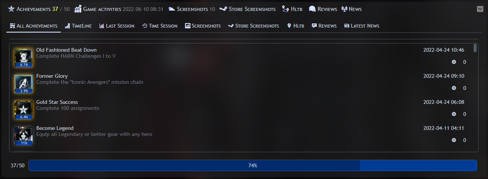
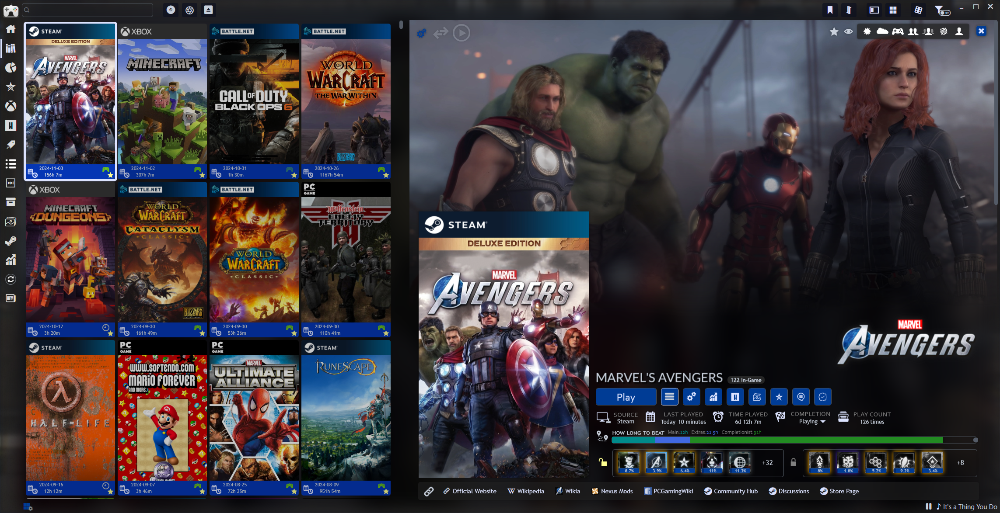
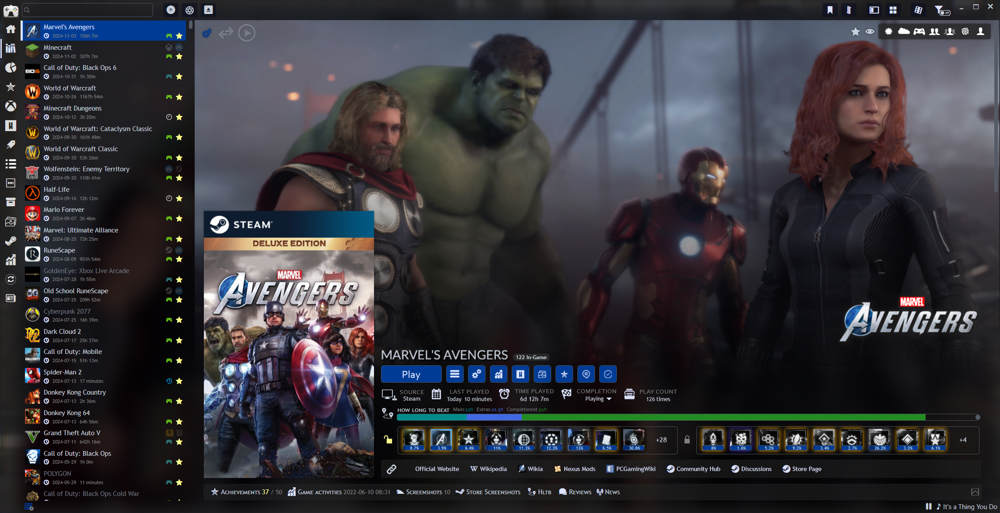

_eMixedNiteMC_ is a theme for [Playnite](https://playnite.link/) based on [eminaguil's](https://github.com/eminaguil) [eMixedNite](https://github.com/eminaguil/eMixedNite)
# eMixedNiteMC    
**_eMixedNiteMC_** features a lot of personalization possibilities, you can get a **simple clean interface** as well as an **advanced interface** that offers a lot of information about your games thanks to various extensions created by the Playnite community. This theme offers both Details View and Grid View almost the same way, has a lot of features like support for game video trailers in the background or cover banners (Included in this theme). Don't forget to check the [installation tutorial](#how-to-install) below and the [FAQ section](#known-bugs--faq) before creating an issue.

  
Table of contents

  <ol>
    <li>
      <a href="#latest-update">Latest Update</a>
    </li>
    <li>
      <a href="#features">Features</a>
    </li>
    <li>
      <a href="#how-to-install">How to install</a>
      <ul>
        <li><a href="#step-1-install-the-theme">Step 1</a></li>
        <li><a href="#step-2configure-your-settings">Step 2</a></li>
        <li> <a href="#step-3-install-the-title-font">Step 3</a></li>
        <li> <a href="#final-step-set-up-your-platform-icons">Final Step</a></li>
      </ul>
    </li>
    <li>
      <a href="#conclusion">Conclusion</a>
    </li>
    <li> 
      <a href="#supported-plugins">Supported Plugins</a>
    </li>
    <li> 
      <a href="#changelog-history">Changelog History</a>
    </li>
    <li> 
      <a href="#known-bugs--faq">Known Bugs/FAQ</a>
    </li>
    <li> 
      <a href="#links">Links</a>
    </li>
  </ol>

 

## Latest Update

* [eMixedNiteMC v3.96](https://github.com/MCC321-QC/eMixedNiteMC/releases/download/v3.96/eMixedNiteMC_3_96.pthm) 
 

 
Demo Gif 
 

## Features

(List only few major features, _there is much more!_)

- Both Grid and Detail views can be set independently
- Support for a lot of extension made by the Playnite community
- Offers almost 100 different options to personalize your game library with the extension [ThemeModifier](https://github.com/Lacro59/playnite-thememodifier-plugin)
- This theme is translated in a few languages (Translated by the community on [Crowdin](https://crowdin.com/project/emixednitemc))
- Integrate game video trailer from the extension [Extra MetaData Loader](https://github.com/darklinkpower/PlayniteExtensionsCollection?tab=readme-ov-file#extensions) in the background
- Include cover banners based on source/platform without any extension or user interation
- Support for cover and background function in [BackgroundChanger](https://github.com/Lacro59/playnite-backgroundchanger-plugin) (~~Will be better implemented soon!~~ [Done!](https://github.com/MCC321-QC/eMixedNiteMC/commit/73751b7314770ee404a310837673ed8a91b74dae))
- Support for showing how much Steam in-game player there is from the extension [Steam News and Players Viewer](https://github.com/darklinkpower/PlayniteExtensionsCollection?tab=readme-ov-file#extensions)
- Almost every element in the UI is multi-line enabled/auto-resize to ensure the best compatibility with every personalization possibilities
- Can show Steam latest news and reviews for your games from the extensions [Steam News and Players Viewer](https://github.com/darklinkpower/PlayniteExtensionsCollection?tab=readme-ov-file#extensions) and [Steam Reviews Viewer](https://github.com/darklinkpower/PlayniteExtensionsCollection?tab=readme-ov-file#extensions)
- Can show available languages and spec requirements for your games from the extensions [SystemChecker](https://github.com/Lacro59/playnite-systemchecker-plugin) and [CheckLocalizations](https://github.com/Lacro59/playnite-checklocalizations-plugin)
- Can show success locked/unlocked in a few ways from the extension [SuccessStory](https://github.com/Lacro59/playnite-successstory-plugin)
- Can show your gameplay history and gameplay capture for each game from the extensions [GameActivity](https://github.com/Lacro59/playnite-gameactivity-plugin) and [ScreenshotVisualizer](https://github.com/Lacro59/playnite-screenshotsvisualizer-plugin)
- Support for [DuplicateHider](https://github.com/felixkmh/DuplicateHider) in Detail List and Grid List
- Custom Font in the title (need to be installed, check [Step 3](#step-3-install-the-title-font) below, optional) 

Preview of some controls
<ol> 
  
 
Quick Settings Wheel 1

 
Top Panel Button 1

 
Top Panel Button 2

    
Source Banners
 

    
Platform Banners
 

 
Quick Settings Wheel 2

 
Quick Settings Wheel 3

 
Quick Settings Wheel 4

 
Quick Settings Wheel 5

 
Expander
</ol>
 

# How to install

### _Step 1_: Install the theme

Double-click or drag and drop the file in Playnite to install it or install it from Playnite using the Add-ons Menu(F9) 

* [eMixedNiteMC 3.96](https://github.com/MCC321-QC/eMixedNiteMC/releases/download/v3.96/eMixedNiteMC_3_96.pthm) 
 

### _Step 2_: Configure your Settings

(_recommended_ **Updated with v3.91**) 
I share the settings I use so you can get the same result as in the showcased screenshots.
I strongly recommend that you test all the options so you can personalize it like you want.
Don't forget that you need the extension [ThemeModifier](https://github.com/Lacro59/playnite-thememodifier-plugin) to edit/save any settings. You can use the
"Quick settings wheels" to have quick access to some settings. When you have the desired settings,
hover your mouse cursor hover the settings you changed and you will see the value in a tooltip popup.
You can then enter your new settings in the constant menu of the extension [ThemeModifier](https://github.com/Lacro59/playnite-thememodifier-plugin). 

- [ ] You can use the arrow on your keyboard to change value one by one if you want to be more precise. 

- [ ] I recommend you use vertical cover images for better compatibility. (But you can adjust the settings to use other forms/ratio of covers) 

* [Playnite Settings](https://github.com/MCC321-QC/eMixedNiteMC/wiki) 
 

### _Step 3_: Install the title font

(_Optional_) 
You will also need the font I use to have the upper case letter style in the title. (_Font found in the SummerNite Theme_)
You can install it by just clicking the .ttf file but you will need to do it each time you restart your computer.
To fix this, you need to add the font to the registry too. You can do so by clicking the file called InstallFont. 

* [eMixedNiteMC Font](https://github.com/MCC321-QC/eMixedNiteMC/releases/download/v3.96/eMixedNiteMC_Font.zip) 
 

### _Final Step_: Set-up your platform icons

(_Optional_ **Updated with version 3.61**) 
The theme can show an icon based on the platform of the game on top of the Playnite banner (if enabled) or platform banner. For this you will need to set your 
icon for each platforms in order to load the icon on the banner correctly. I made a little collection (Not ready yet) so you don't need to search them all. 
To apply an icon, open the Library Manager(CTRL+W) and apply an icon for each platform by clicking on "Select Icon" in the icon section. You can also disable 
the library banner in the settings to show library icons on banners. Icons for most Library are also included in this theme. 

* [Platform Icons](#) (Coming soon!) 
 

## Conclusion:

You will see below the list of all the plugins this theme support, thanks to [darklinkpower](https://github.com/darklinkpower) for letting me use his code
from the [Stardust](https://github.com/darklinkpower/Stardust) theme that integrate the video trailer in eMixedNiteMC and finally a **big fat thanks** to [eminaguil](https://github.com/eminaguil) for
his awesome works and for letting me modify his theme. 

Preview screenshots
<ol> 
  

 
**It look like this when you play video trailer not using the option to hide the "Top Part".**

 
**It look like this when you play video trailer using the option to hide the "Top Part".**
</ol>
 

## Supported Plugins

These plugin are supported but **not needed**, feel free to only use the ones you are interested in. The only
extension I strongly recommend is [ThemeModifier](https://github.com/Lacro59/playnite-thememodifier-plugin) and [Theme Options](https://github.com/ashpynov/ThemeOptions) so you can edit/save settings and edit the color pattern. 

- [ ] Source/Platform Banners are include in eMixedNiteMC and are not loaded from the plugin [ThemeExtras](https://github.com/felixkmh/ThemeExtras-for-Playnite) 

Show supported plugins
<ol> 

>__Click on any images to see it full size.__

| Plugins                                                                                             | Info                                                                                                  | Preview                                                                                                                                                                                                                                                                                                                                                                                                                                                                                                                                                   |
| ----------------------------------------------------------------------------------------------------| ----------------------------------------------------------------------------------------------------- | --------------------------------------------------------------------------------------------------------------------------------------------------------------------------------------------------------------------------------------------------------------------------------------------------------------------------------------------------------------------------------------------------------------------------------------------------------------------------------------------------------------------------------------------------------- |
| [GameActivity](https://github.com/Lacro59/playnite-gameactivity-plugin)                             | Show your gaming history and info like fps or gpu temp for each session                               |                                                                                                                                                                                                                         |
| [SystemChecker](https://github.com/Lacro59/playnite-systemchecker-plugin)                           | Show the minimum and suggested PC specifications configuration needed for each games                  |                                                                                                                                                                                                                                                                                                                                                                                           |
| [CheckLocalizations](https://github.com/Lacro59/playnite-checklocalizations-plugin)                 | Show the audio and subtitle languages available for each games                                        |                                                                                                                                                                                                                                                                                                                                                                                 |
| [HowLongToBeat](https://github.com/Lacro59/playnite-howlongtobeat-plugin)                           | Show the time to beat a game from [HowLongToBeat](https://howlongtobeat.com/) and account data        |                                                                                                                                                                                                                          |
| [Extra Metadata Loader](https://github.com/darklinkpower/PlayniteExtensionsCollection#extensions)   | Add video trailer in the background and the logo for each games with a handy search/download manager  |                                                                                                                                                                                                                                                                                       |
| [DuplicateHider](https://github.com/felixkmh/DuplicateHider)                                        | Manage your duplicates by hiding/converging them into 1 and adding a button to select them.           |                                                                                                                                                                                                                                                                                                                                                                                |
| [ScreenshotsVisualizer](https://github.com/Lacro59/playnite-screenshotsvisualizer-plugin)           | Play/Show and manage your game capture, screenshots and videos                                        |                                                                                                                                                                                                                                                                               |
| [SuccessStory](https://github.com/Lacro59/playnite-successstory-plugin)                             | Show your achievements locked/unlocked from Steam, Xbox, GOG, Epic Games, RPCS3 and more              |                                                                          |
| [ThemeModifier](https://github.com/Lacro59/playnite-thememodifier-plugin)                           | Change color palette and edit various supported constants(options)                                    |                                                                                                                                                                                                                                                                                            |
| [LibraryManagement](https://github.com/Lacro59/playnite-librarymanagement-plugin)                   | Integrate the features list on top panel and can manage/enhanced some of your games data              |                                                                                                                                                                                                                                                                                                                                                                        |
| [News Viewer](https://github.com/darklinkpower/PlayniteExtensionsCollection#extensions)             | Show latest news on steam for your games and show number of player currently playing                  |                                                                                                                                                                                                                                                                                                                  |
| [CheckDlc](https://github.com/Lacro59/playnite-checkdlc-plugin)                                     | Show a list of all dlc for your games and tells you the price and wich one you own                    |                                                                                                                                                                                                                                                                                                                                                                                                     |
| [Review viewer](https://github.com/darklinkpower/PlayniteExtensionsCollection#extensions)           | Show latest reviews on steam for your games                                                           |                                                                                                                                                                                                                                                                                                                                                                                                                                                                             |
| [BackgroundChanger](https://github.com/Lacro59/playnite-backgroundchanger-plugin)                   | Can change background and cover image and make them change after x time                               |                                                                                                                                                                                                                                                                                     |
| [Game Relations](https://github.com/darklinkpower/PlayniteExtensionsCollection#extensions)          | Show other games that are related to the one selected based on their metadata                         |                                                                                                                                                                                                           |
| [PlayNotes](https://github.com/darklinkpower/PlayniteExtensionsCollection#extensions)               | Add an element in the UI to add note, import guide from steam and more                                |                                                                                                                                                                                                                                                                                                                                                                                                                                                                                |
| [Steam Store Screenshots](https://github.com/darklinkpower/PlayniteExtensionsCollection#extensions) | Show screenshots from Steam store for your games                                                      |                                                                                                                                                                                                                                                                                                                                                                                                                                                                    |
| [Playnite Sound Mod](https://github.com/ashpynov/PlayniteSound)                                     | Can play audio file on certain Playnite event and manage/download and play/pause music for your games |                                                                                                                                                                                                    |
| [BackToGame](https://github.com/ashpynov/BackToGame)                                                | Add a button that automatically get you back in your game when you click it                           |                                                                                                                                                                                                                                                                                                                                                                                                                                                                                |
| [ThemeExtras](https://github.com/felixkmh/ThemeExtras-for-Playnite)                                 | Add stars to your score metadata, add icon for your links, add a completion drop-in menu and more     |         |
| [Theme Options](https://github.com/ashpynov/ThemeOptions)                                           | Add preset that overwrite files in the theme, for example you can change the Playnite logo            |                                                                                                                                                                                                                                                                                                                                                                                                                                                                             |

</ol>
 

## Changelog History

Complete changelog
<ol>
    
- **_Version: 3.96_**
  - Updated localization
    - French updated by [Autonome](https://crowdin.com/profile/autonome)
    - Added "LOCGameViewWebViewTitle" for plugin [Web Explorer](https://github.com/darklinkpower/PlayniteExtensionsCollection?tab=readme-ov-file#extensions)

- **_Version: 3.95_**
  - Added support for plugin [Web Explorer](https://github.com/darklinkpower/PlayniteExtensionsCollection?tab=readme-ov-file#extensions) from [darklinkpower](https://github.com/darklinkpower)
    - You can only edit the height of the panel manually in the constant file for now
  - Added trigger to disable visibility of game background image when video is visible ([Asked](https://github.com/MCC321-QC/eMixedNiteMC/issues/51) by [STOPchris1](https://github.com/STOPchris1))

- **_Version: 3.91_**
  - Change constant file default values for 2K display
    - Added setting for every plugins supported and playnite for 2K display in the wiki
    - Added a section for 1080p display with the constant file with the right default value for 1080p
  - Fixed margin in the options title in for the plugin ThemeOptions
  - Added missing file for the option "Windows 11 rounded corner disabled" in ThemeOptions

- **_Version: 3.90_**
  - Fixed details panel when option for 1 column is enabled ([Asked ](https://github.com/MCC321-QC/eMixedNiteMC/issues/49)by [xCeeTee](https://github.com/xCeeTee))
    - All the item will now be visible
    - Margins still need to be worked on for when this option is enabled
  - Added support for plugin [Theme Options](https://github.com/ashpynov/ThemeOptions) from [ashpynov](https://github.com/ashpynov)
    - Added a preset to enable/disable rounded corner for Windows 11 ([Asked](https://github.com/MCC321-QC/eMixedNiteMC/issues/48) by [lionnesquaer](https://github.com/lionnesquaer))
    - Added a preset to change the Playnite logo of the theme
      - There is 5 Playnite logo you can choose from
      - eMixedNiteMC logo is enabled by default
      - To re-enable the default Playnite logo, go in the plugin settings of [Theme Options](https://github.com/ashpynov/ThemeOptions)
  - Re-added both details view value horizontal alignement options
    - Removed Global Text banner vertical and horizontal alignment options from [ThemeModifier](https://github.com/ashpynov/ThemeOptions?tab=readme-ov-file) file
      - You can still change these options manually in the constants file
  - Changed default value of constants for Top Panel, Side Panel and Side Icon Panel
    - Default value for these constants is now "transparent"

- **_Version: 3.85_**
  - Reworked details panel in game view of both grid view and details View
    - Added icons for each category ([Asked](https://github.com/MCC321-QC/eMixedNiteMC/issues/45) by [misspent](https://github.com/misspent))
    - Added margin between each category for better distinction
    - Added "Date Added" text category (Not clickable)
    - Added "Installation Folder" button category
    - Each element are now perfectly aligned
    - Changed the 3 colors of "Scores" values to be more in context
  - Added second links panel in details panel
    - Enabled by default
    - Visibility can be toggle in [ThemeModifier](https://github.com/Lacro59/playnite-thememodifier-plugin)
    - Added setting to disable visibility of default links panel when second links panel is enable
  - Added support for some function of plugin [ThemeExtras](https://github.com/felixkmh/ThemeExtras-for-Playnite) from [felixkmh](https://github.com/felixkmh)
    - Support for Stars Reviews
      - Stars will be visible for User Score, Critic Score and Community Score 
    - Support for links icon
      - Added option to toggle visibility of links icon
      - enabled by default, can be changed in [ThemeModifier](https://github.com/Lacro59/playnite-thememodifier-plugin)
      - Icon are visible in both links panel
    - Support for completion status drop-in control (Button that can change settings)
      - Enabled by default, can be changed in [ThemeModifier](https://github.com/Lacro59/playnite-thememodifier-plugin)
    - Support for settable properties (Button that can change settings)
      - Added a Favorite and Hidden button beside top features panel
      - Enabled by default, can be changed in [ThemeModifier](https://github.com/Lacro59/playnite-thememodifier-plugin)
  - Fixed game name not visible properly when not enough space
    - Game name will now wrap on next line when not enough space
    - Players in-game from plugin [Steam News ans Players Viewer](https://github.com/darklinkpower/PlayniteExtensionsCollection?tab=readme-ov-file#extensions) will wrap on second line too
  - Fixed option "Global title visibility if logo is enable"
    - Should have been "Global title visibility if logo is visible"
    - Fixed the behavior so title will be visible when there is no logo available
  - Better integration of the plugin [HLTB](https://github.com/Lacro59/playnite-howlongtobeat-plugin)
    - Should now be more smooth when changing game while using this plugin
  - Little re-organisation of [ThemeModifier](https://github.com/Lacro59/playnite-thememodifier-plugin) file (Constant menu options)
    - Removed both details panels value horizontal alignement options
      - You can still change these two settings in the constant file manually
    - Re-organization of the last section "Extra addons settings"
  - Added some missing banners

- **_Version: 3.75_**
  - Added support for plugin [Playnite Sound Mod](https://github.com/ashpynov/PlayniteSound) from [ashpynov](https://github.com/ashpynov), [cnapolit](https://github.com/cnapolit) and [Joyrider3774](https://github.com/joyrider3774) ([Asked](https://github.com/MCC321-QC/eMixedNiteMC/issues/15) by [Mellified](https://github.com/Mellified))
    - Can show name of currently played song and a control to Play/Pause music ([Preview](https://private-user-images.githubusercontent.com/69739155/377846856-42a79aea-8764-4268-94cc-74ac3d8fc5bd.png?jwt=eyJhbGciOiJIUzI1NiIsInR5cCI6IkpXVCJ9.eyJpc3MiOiJnaXRodWIuY29tIiwiYXVkIjoicmF3LmdpdGh1YnVzZXJjb250ZW50LmNvbSIsImtleSI6ImtleTUiLCJleHAiOjE3Mjk0Mjc1MjYsIm5iZiI6MTcyOTQyNzIyNiwicGF0aCI6Ii82OTczOTE1NS8zNzc4NDY4NTYtNDJhNzlhZWEtODc2NC00MjY4LTk0Y2MtNzRhYzNkOGZjNWJkLnBuZz9YLUFtei1BbGdvcml0aG09QVdTNC1ITUFDLVNIQTI1NiZYLUFtei1DcmVkZW50aWFsPUFLSUFWQ09EWUxTQTUzUFFLNFpBJTJGMjAyNDEwMjAlMkZ1cy1lYXN0LTElMkZzMyUyRmF3czRfcmVxdWVzdCZYLUFtei1EYXRlPTIwMjQxMDIwVDEyMjcwNlomWC1BbXotRXhwaXJlcz0zMDAmWC1BbXotU2lnbmF0dXJlPWJiNTJlMWJhOWI1ZDFjY2QwNGZjYWRjNmM3ZjJiYzM3ZWEyZTg0OWVjYzZjODVhY2UwODI5NzllYmMzMmRjN2YmWC1BbXotU2lnbmVkSGVhZGVycz1ob3N0In0.8vnzwfH3QtiKoVFKAVnLNaGB2nkbcHjupsZgXKs7QUU))
    - Visibility set to false by default, can be changed in plugin [ThemeModifier](https://github.com/Lacro59/playnite-thememodifier-plugin)
  - Bug with [Playnite Sound Mod](https://github.com/ashpynov/PlayniteSound) when pausing music and selecting another game
    - If you pause music then change game then go back to initial game you will not be able to play/unpause music
    - To fix this just click on another game that has music
  - Added support for plugin [BackToGame](https://github.com/ashpynov/BackToGame) from [ashpynov](https://github.com/ashpynov) ([Asked](https://github.com/MCC321-QC/eMixedNiteMC/issues/34) by [BLACK4585](https://github.com/BLACK4585))
    - Will show an icon after the play button if you have the plugin installed and a game is running
  - Removed white border around Playnite window ([Asked](https://github.com/MCC321-QC/eMixedNiteMC/issues/40) by [danjiss](https://github.com/danjiss))
    - This also disable rounded corner for Playnite window in Windows 11
  - Fixed Button of plugin [CheckDLC](https://github.com/Lacro59/playnite-checkdlc-plugin) being always visible
    - Button will now be shown only when game has DLC and plugin is installed
  - Better integration of background function from plugin [BackgroundChanger](https://github.com/Lacro59/playnite-backgroundchanger-plugin)
    - Better performance when using background function of this plugin
    - Fixed problem when function for covers was set to off resulting in covers being not visible
    - I don't recommend using both cover and background function at the same time
  - Added option to disable visibility of title if logo are enabled ([Asked](https://github.com/MCC321-QC/eMixedNiteMC/issues/29) by [Elaborendum](https://github.com/Elaborendum))
    - Player currently playing from plugin [Steam News and Players Viewer](https://github.com/darklinkpower/PlayniteExtensionsCollection?tab=readme-ov-file#extensions) will now still be visible when title is disabled
    - Title visibility if logo are enabled set to true by default
    - You can change this setting in plugin [ThemeModifier](https://github.com/Elaborendum)
    - Title visibility button from quick setting wheel will now be visible only when needed
  - Fixed error in Blend
    - If you want to use Blend remove "Inverted" in the third and fourth "InvertedBooleanToVisibilityConverter"
    - This fix is for both GridViewGameOverview.xaml and DetailsViewGameOverview.xaml
  - Added rounded corner in all ListBox selection

- **_Version: 3.61_**
  - API updated to 2.6.0
  - Localization files upate
    - Chinese Simplified updated by [laiTM](https://crowdin.com/profile/laitm)
    - Italian updated by [elpideus](https://crowdin.com/profile/elpideus)
    - localization files clean-up
    - Added support for few more language
  - Added support for plugin [Game Relations](https://github.com/darklinkpower/PlayniteExtensionsCollection?tab=readme-ov-file#generic) from darklinkpower ([Asked](https://github.com/MCC321-QC/eMixedNiteMC/issues/34) by [BLACK4585](https://github.com/BLACK4585))
  - Added support for plugin [PlayNotes](https://github.com/darklinkpower/PlayniteExtensionsCollection?tab=readme-ov-file#generic) from darklinkpower ([Asked](https://github.com/MCC321-QC/eMixedNiteMC/issues/34) by [BLACK4585](https://github.com/BLACK4585))
  - Added support for plugin [Steam Store Screenshots](https://github.com/darklinkpower/PlayniteExtensionsCollection?tab=readme-ov-file#generic) from darklinkpower ([Asked](https://github.com/MCC321-QC/eMixedNiteMC/issues/32) by [BLACK4585](https://github.com/BLACK4585))
  - Fixed how [Steam Reviews Viewers](https://github.com/darklinkpower/PlayniteExtensionsCollection?tab=readme-ov-file#generic) data visibility in expander is being triggered
    - Before update 3.6 you needed a link named "Steam Store" in the first 12 link that your game had if the game was not from Steam
    - Now you only need a link to the Steam game no matter the name of the link or the position in the list of links
  - Added rounded border for windows 11
  - Added option for rounded border on covers in grid list ([Asked](https://github.com/MCC321-QC/eMixedNiteMC/issues/18) by [AAide](https://github.com/AAide))
    - Set to true by default
    - Setting added in [ThemeModifier](https://github.com/Lacro59/playnite-thememodifier-plugin) settings
  - Added shadow effect behind favorite icon on cover in grid list when info panel is disabled
  - Expander height is now set automatically depending of the content inside ([Asked](https://github.com/MCC321-QC/eMixedNiteMC/issues/10) by [BanCrash](https://github.com/BanCrash))
    - Removed option "Global expander panel height" since its not used anymore
  - Links will now wrap and go on a second line if not enough space ([Asked](https://github.com/MCC321-QC/eMixedNiteMC/issues/31) by [BLACK4585](https://github.com/BLACK4585))
  - Removed option "Details view title horizontal alignment" from ThemeModifier settings
    - You can still change this setting in the constants.xaml file manually
  - Removed option "Grid view title horizontal alignment" from ThemeModifier settings
    - You can still change this setting in the constants.xaml file manually"
  - Removed option "Grid list button in cover vertical alignment" from ThemeModifier settings
    - You can still change this setting in the constants.xaml file manually"

- **_Version: 3.5_**
  - Localized files from the [language pack](https://github.com/MCC321-QC/eMixedNiteMC-Language-Pack) are now included in the theme
    - [eMixedNiteMC Language Pack](https://github.com/MCC321-QC/eMixedNiteMC-Language-Pack) is no longuer needed and can be uninstalled safely
    - Updated localization
  - Added random game selector button in top panel
  - Fixed bug when various options are not showing in a menu
    - This fix game play action not being shown while addind a new game session in [GameActivity](https://github.com/Lacro59/playnite-gameactivity-plugin) plugin ([Asked](https://github.com/MCC321-QC/eMixedNiteMC/issues/12) by [BanCrash](https://github.com/BanCrash))
  - Fixed some platform banners name ([Asked](https://github.com/MCC321-QC/eMixedNiteMC/issues/14) by [arshesney](https://github.com/arshesney))
    - Added some store banners ([Thanks](https://playnite.link/forum/thread-801-post-8546.html#pid8546) to [Mellified](https://github.com/Mellified))
    - Fixed EA app banner after updating from Origin ([Thanks](https://github.com/MCC321-QC/eMixedNiteMC/issues/16) to [blackparadox](https://github.com/blackparadox))
    - You may have to change the source of games from this library manually
  - Added installation size field in game details panel ([Done](https://github.com/MCC321-QC/eMixedNiteMC/pull/13) by [BanCrash](https://github.com/MCC321-QC/eMixedNiteMC/issues?q=is%3Apr+author%3ABanCrash))
    - Can be toggle on and off in playnite settings
  - Added support for Steam in-game player data from plugin [NewsViewer](https://github.com/darklinkpower/PlayniteExtensionsCollection#generic)
    - Data will show after the game title for any Steam game and for games that have a link to the steam store page of said game
    - Visibility can be toggle in the settings of [NewsViewer](https://github.com/darklinkpower/PlayniteExtensionsCollection#generic) in Add-ons menu
  - Added Theme icons for almost all library for plugin DuplicateHider ([Asked](https://github.com/MCC321-QC/eMixedNiteMC/issues/17) by [xCeeTee](https://github.com/xCeeTee))
  - Added animation to top part element like play video toggle button or feature panel when the option to toggle off top part is activated and a video is playing

- **_Version: 3.1_**
  - Added setting to force-on visibility of [HLTB](https://github.com/Lacro59/playnite-howlongtobeat-plugin) button when game as no data and plugin is installed (Asked by Jordyn11)
  - Added margin around platform icon
  - Fixed Riot Launcher banner name ([Asked](https://playnite.link/forum/thread-801-post-8530.html#pid8530) by [xCeeTee](https://playnite.link/forum/user-3436.html))
    - Changed "Riot Launcher.png" into "Riot Games.png"
  - Changed Review Viewer triggering visibility on the first 12 link
    - The theme will now look for links named "Steam Store" instead of "Steam store"
  - Fixed background bottom blur effect slider setting range being not big enough ([Asked](https://playnite.link/forum/thread-801-post-8538.html#pid8538) by [DrAlexander](https://playnite.link/forum/user-3046.html))
    - Slider setting range can go up to "2.0" instead of "1.0"

- **_Version: 3.0_**
  - Game banners system as been reworked
      - Platform banners are now included in the theme ([Asked](https://github.com/MCC321-QC/eMixedNiteMC/issues/8) by [daephx](https://github.com/daephx))
          - You can safely delete banners from library manager
          - You can add custom png platform banners in the "PlatformsExtra" folder in the theme installation folder
      - Platform icons are untouched so are still loaded from the library manager
          - The icon is visible only when library banner is set to be visible
      - Store/library banners are now linked to the source name and not the library name
          - Added source banners and icons for almost all library plugins
          - You can add custom png source banners/icon in the "Stores" folder in the theme installation folder
      - Added a setting to enable Playnite library banner ([Asked](https://github.com/MCC321-QC/eMixedNiteMC/issues/8) by [daephx](https://github.com/daephx))
          - Playnite banner is set to be visible when the game library is Playnite and the game as no source banner
          - The banner is binded to the library banner visibility setting
          - Platform icon can be visible on the Playnite banner if icon setting is enable
  - Fixed visibility of locked/unlocked achievements list when there is none while using standard list
      - Standard list is now the default settings instead of compact unlocked list
  - Fixed left margin of the cover image when cover visibility is disabled
      - The game top info panel will now "clip" to the border when covers are disabled
  - Added settings to set color of text and link/title in game description
  - Fixed element in top panel being visible when you play a video and toggle visibility of top part ([Asked ](https://playnite.link/forum/thread-801-post-8325.html#pid8325)by [skywalker6705](https://playnite.link/forum/user-2841.html))
      - This affect quick settings wheel, top part visibility setting button, play video button and the top features panel
      - These element will not be visible when your cursor is not hovering the video and you have toggled visibility of top part
  - Added a setting to completely disable the top features panel when a video is playing
      - This settings is usefull when the features panel is hovering the video controls if you have a wide list and small game view
  - Fixed misalignment of game title in details list when using the "less info" option
  - Added option to set the height of the expander when expanded
  - Almost all appearance settings of supported extension are now working
      - Specially needed for the visibility/height of plugin panel in expander
      - Fixed [HLTB](https://github.com/Lacro59/playnite-howlongtobeat-plugin) bar and label in game top info panel being binded to the visibility setting of the plugin button
      - Fixed [HLTB](https://github.com/Lacro59/playnite-howlongtobeat-plugin) button being visible when the current selected game has no [HLTB](https://github.com/Lacro59/playnite-howlongtobeat-plugin) data
  - Fixed some element visibility in the expander
      - Fixed some expander element showing when respective plugin are not installed
      - [ReviewViewer](https://github.com/darklinkpower/PlayniteExtensionsCollection#extensions) is now visible only when the game is from steam or has a link named "Steam store"
      - Note that the theme will check only in the first 12 link for one named "Steam store"
      - [ReviewViewer](https://github.com/darklinkpower/PlayniteExtensionsCollection#extensions) now trigger the visibility of the expander when reviews are available
      - [SuccessStory](https://github.com/Lacro59/playnite-successstory-plugin) progress bar is now visible only when appropriate tab is selected in expander
      - Fixed expander being visible when you manually disable a plugins panel in the add-ons menu and it was the only one to show
  - Added a trigger to the visibility of settings in all quick settings wheels
      - All quick settings wheel now show only the needed settings for the present situation
  - Added height setting for the bottom blurring effect of the background image in game view ([Asked](https://playnite.link/forum/thread-801-post-8479.html#pid8479) by [DrAlexander](https://playnite.link/forum/user-3046.html))
  - Fixed game score order in details panel to have same order as default theme ([Done](https://github.com/MCC321-QC/eMixedNiteMC/pull/9) by [BanCrash](https://github.com/BanCrash))
  - Fixed background of some element being visible when said element is disabled in the settings
      - Top features panel background will now not be visible when plugin setting is disabled
      - Links panel background and label will now not be visible when Playnite setting is disabled
  - Fixed top info panel being pushed down when logo is too big
      - The "top part" panel is now behind the cover and top info panel instead of being on top of them
      - You will most likely need to add the height settings value of cover and banner to the top part height setting
      - That way the top info panel should not move if cover is disabled or logo is too big
  - Little re-organisation of settings list in [ThemeModifier](https://github.com/Lacro59/playnite-thememodifier-plugin) constant menu
      - Removed both [DuplicateHider](https://github.com/felixkmh/DuplicateHider) settings to have 2 more line of settings available (Max settings lines is 100 and we are presently at 99)
      - Some extra extension settings have been placed at the end of the constant menu in the section called "Add-ons Extra Settings"

* **_Version: 2.85_**
  * Added support for cover function in [BackgroundChanger](https://github.com/Lacro59/playnite-backgroundchanger-plugin)
  * Trigger Last Played value to show "Not Played" instead of "Never Not Played"
  * Trigger PlayCount value to show "Not Played" instead of "0"
    * Add "times" after PlayCount Value
    * Will show "time" if selected game was played only once
  * Added support for multiline in most GameView element ([Asked](https://github.com/MCC321-QC/eMixedNiteMC/issues/7) by [BanCrash](https://github.com/BanCrash))
    * Added to quick settings wheels, button panel, game info panel, HLTB text and Expander headers
    * Fixed vertical margin between each "row" in game info in top panel
  * Fixed cover vertical alignement when logo big enough to push down game information in top panel

* **_Version: 2.81_**
  * Fixed horizontal alignement settings for details panel in both Detail/Grid views ([Asked](https://playnite.link/forum/thread-801-post-8425.html#pid8425) by [xCeeTee](https://playnite.link/forum/user-3436.html))
    * Both horizontal alignement settings in constant menu of [ThemeModifier](https://github.com/Lacro59/playnite-thememodifier-plugin) now work as it should

* **_Version: 2.80_**
  * Added game play count in game view ([Asked](https://github.com/MCC321-QC/eMixedNiteMC/issues/2) by [BanCrash](https://github.com/BanCrash))
    * Added constants for both details/grid views
    * Added in game view quick setting wheel for both details/grid views
  * Fixed Source Title being visible when it should not
    * The Source will not be visible when there is no Source selected in GameDetails
    * The Source will not be visible when Source is disabled in Playnite settings
    * Centering of Source title, label and text in both details/grid views
  * Removed some margin in Game Description View

* **_Version: 2.77_**
  * Fixed [HLTB](https://github.com/Lacro59/playnite-howlongtobeat-plugin) and [SuccessStory](https://github.com/Lacro59/playnite-successstory-plugin) Labels being shown when said plugins is not installed (Asked by [kick12134](https://playnite.link/forum/user-3758.html))
  * Features Panel now fully support [LibraryManagment](https://github.com/Lacro59/playnite-librarymanagement-plugin) plugin
    * Will now be visible only when [LibraryManagment](https://github.com/Lacro59/playnite-librarymanagement-plugin) is installed
    * Use the plugins settings only when set on "Top Part"
    * Centering of Features Panel when not set on top part
    * Include the "Merge all feature that use the same icon" setting (Asked by [Mellified](https://playnite.link/forum/user-1733.html))
  * Fixed options to show or not [HLTB](https://github.com/Lacro59/playnite-howlongtobeat-plugin) and [SuccessStory](https://github.com/Lacro59/playnite-successstory-plugin) when Expander is open

* **_Version: 2.75_**
  * Fix Banner/Cover no fitting in GridList when set too small
  * Centering of some elements
  * Added localization string to every Tooltip and Title
  * The extension [eMixedNiteMC Language Pack](https://github.com/MCC321-QC/eMixedNiteMC-Language-Pack) is now needed to run this theme correctly
    * Almost every tooltip will not work and some title too if you dont install it
  * Added completion status translation system from [eMixedNite](https://github.com/eminaguil/eMixedNite)(Thanks to [eminaguil](https://github.com/eminaguil)!)
    * Use the same values you have in your Library Manager(CTRL+W)
    * The values can be set in [ThemeModifier](https://github.com/Lacro59/playnite-thememodifier-plugin) Constant menu
 

* **_Version: 2.50_**
  * Fixed platform/banner icon alignement in vertical banners
  * Removed Vertcial/Horizontal alignement constant for icon in banners
  * Fixed description panel width when details panel is toggled off (Thanks to eminaguil)
  * Added support for plugin CheckDlc from Lacro59
    * New button to open available DLC list
    * Button shown only when DLC list is available
  * Added support for plugin Review Viewers from darklinkpower
    * New "Reviews" title in expander
    * New "Reviews" element in expander
    * These will be shown even when there is no reviews available, if the plugin is installed
  * Added support for plugin BackgroundChanger from Lacro59
    * Support for background only.
  * Better support for plugin Extra Meta Data Loader from darklinkpower
    * Integration of normal video player. Dont use the "Alternate Video Player" option.
    * Integration of logo loader.
    * All settings in Extra Metadata Loader should now work fine
    * "Vertical alignment of video controls" should be set to "Top" in Extra Metadata Loader settings
  * Added option to toggle off cover/banners
  * Update to API 2.1.0
 

* **_Version: 2.11_**
  * Fix for News Viewer title visibility and blank expander
    * The expander now auto-select first tab when you open it (Thank to eminaguil)
    * News Viewer title will now be visible only when there is news available.
    * Changed title from "Games News" to "LOC_NewsViewer_NewsViewerControl_NewsLabel"
 

* **_Version: 2.1_**
  * Added support for plugin News Viewer
    * New "Game News" title in expander
    * New "Latest News" element in expander 
 

* **_Version: 2.0_**
  * Playnite 9 support, no longuer working in Playnite 8
  * Added support for plugin button of SystemChecker and CheckLocalizations
  * All covers/banners in Grid List, Grid View and Details View have their own constant so they can be set differently
  * Constant GridListCoverOutlineVisible now control visibility of "Grid item border width" found in the Grid View settings 
section of Playnite and no longuer control "Game(s) Selected Cover Outline"
    * Settings of "Grid item border width" can be set to a maximum value of "4"
    * "Game(s) Selected Cover Outline" now forced-on
  * Change expander style with the new one that first appeared in eMixedNite version 2.20
  * DuplicateHider support in both Details List and Grid List
  * Added 3 constant for the background color of the Top Panel, Side Icon Panel and Side Panel
    * Can be set to "transparent"
    * Bug when trying to change color from theme modifier constant menu
    * To change it go in the theme folder and manually change it in the constant.xml file
  * Added 2 constant for Details Panel minimum width in both Grid View and Details View
  * Added 1 constant for Feature Panel Opacity when set on top part
  * Added all cover/banner constant to Quick Settings Wheel
  * Added even more constant for all views so they can be set differently
  * More interface re-configuration and optimization
 

* **_Version: 1.5.1_**
  * Fixed constant default settings
 

* **_Version: 1.5_**
  * Added constant for game icon height in details panel
  * Added support for DuplicateHider in DetailView
  * Added support for game logo from ExtraMetadata Tool
    * Added 3 constant to set height, horizontal alignement and visibility of the game logo
    * Added 2 constant to set horizontal alignement and visibility of the game title
  * Fix bug with top part being hidden when installing the theme and when game have no cover image
  * Fix hidding animation of the top part not working
  * Some interface optimization
 

* **_Version: 1.0_**
  * First Release
  * Add support for trailer video from ExtraMetadata Tool
    * Thanks to darklinkpower for is code from Stardust theme
    * Video play in the background replacing the background image
    * Support video trailer and micro trailer
    * Button to toggle audio On/Off
    * Button to hide the top part for better view of the trailer
    * Added 4 constant settings
  * Added constants for Gameview Cover/Banner
  * Interface re-configuration

</ol>
 

## Known Bugs / FAQ
 

**Playnite does not look the same as the screenshot after installing the theme.**
- Be sure to check my settings (check [Step 2](#step-2configure-your-settings) higher in the ReadMe). 

**My settings does not save when Playnite restart.**
- You need to save your settings in the constant menu of the extension [ThemeModifer](https://github.com/Lacro59/playnite-thememodifier-plugin). 

~~**My covers are missing in GameView.**~~ Fixed in [v3.75](https://github.com/MCC321-QC/eMixedNiteMC/commit/73751b7314770ee404a310837673ed8a91b74dae)
- ~~Its a bug with the extension [BackgroundChanger](https://github.com/Lacro59/playnite-backgroundchanger-plugin). Disable said extension.~~  

**My covers are not rounded in both bottom corners after changing various settings.**
- Go to GridView and back to DetailsView or Vice&Versa or restart Playnite. 

**I don't know where to add banners/icons for this theme.**
- Refer to this [discussion](https://github.com/MCC321-QC/eMixedNiteMC/discussions/30) for more info. 

**The UI becomes laggy when using this theme.**
- Refer to [this issue](https://github.com/MCC321-QC/eMixedNiteMC/issues/28) fore more info. 
 

## Links

- [ ] **[Wiki](https://github.com/MCC321-QC/eMixedNiteMC/wiki)** 
- [ ] **[Issues](https://github.com/MCC321-QC/eMixedNiteMC/issues)** 
- [ ] **[Discussions](https://github.com/MCC321-QC/eMixedNiteMC/discussions)** 

You can help translate this theme on **[Crowdin](https://crowdin.com/project/emixednitemc)** 

